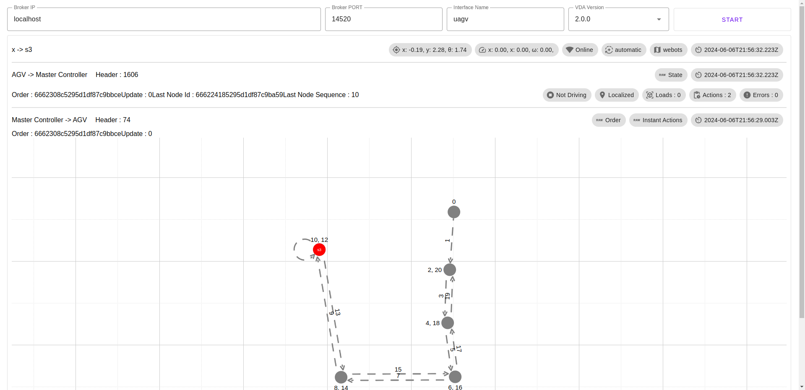
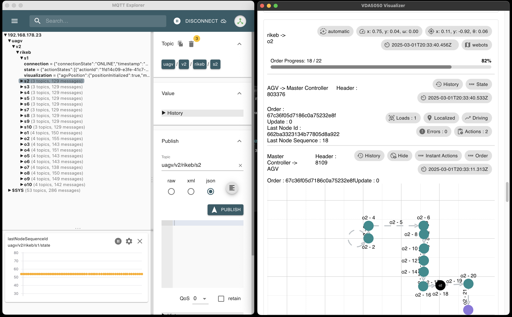

# VDA5050 Visualizer

https://github.com/bekirbostanci/vda5050_visualizer/assets/26343575/06f22e56-1547-451b-97b9-870a715d525e

A visualization tool for VDA5050 AGVs (Automated Guided Vehicles) that supports both WebSocket and Electron IPC MQTT connections.

## Shared MQTT Client

The application uses a shared MQTT client to optimize connection management and prevent multiple connections when one already exists. This approach provides several benefits:

1. **Efficiency**: Only one MQTT connection is created, regardless of how many AGVs are being monitored
2. **Simplicity**: Components can subscribe to specific topics without managing the connection
3. **Reliability**: Connection management is centralized, making it easier to handle reconnections
4. **Flexibility**: Works with both WebSocket and Electron IPC approaches

### Key Components

- **SharedMqttClient**: A singleton class that manages a single MQTT connection shared across the application
- **VDA5050Agv**: Controller for individual AGVs that uses the shared client for WebSocket connections
- **VDA5050Visualizer**: Component that creates and manages the shared client for the application
- **VDA5050Controller**: Main controller that coordinates AGV instances and message routing

### Usage Example

```typescript
import { sharedMqttClient } from './utils/shared-mqtt-client';

// Connect to the MQTT broker
await sharedMqttClient.connect(
  'localhost',
  '9001',
  'client_id',
  'username',
  'password'
);

// Subscribe to topics
sharedMqttClient.subscribe(['topic1', 'topic2']);

// Subscribe to messages
const unsubscribe = sharedMqttClient.subscribeToMessages((topic, message) => {
  console.log(`Received message on ${topic}:`, message);
});

// Publish a message
sharedMqttClient.publish('topic', { data: 'value' });

// Unsubscribe from messages when done
unsubscribe();

// Disconnect when the application is shutting down
// Note: This will disconnect all components using the shared client
sharedMqttClient.disconnect();
```

## Connection Types

The application supports two types of MQTT connections:

1. **WebSocket**: Direct connection to an MQTT broker via WebSocket
2. **Electron IPC**: Connection via Electron's IPC mechanism (for desktop applications)

The connection type can be configured in the application settings.

## Desktop Application

VDA5050 Visualizer is also available as a desktop application built with Electron. The desktop version provides all the features of the web application plus native desktop integration.

### Running the Desktop App in Development

To run the desktop application in development mode:

```bash
npm run electron:dev
```

This will start both the Vite development server and the Electron application.

### Building the Desktop App

To build the desktop application for distribution:

```bash
npm run electron:build
```

This will create platform-specific installers in the `dist_electron` directory. The application is configured to build for:
- Windows (.exe installer)
- macOS (.dmg)
- Linux (AppImage)

### Auto Updates

The desktop application supports automatic updates through GitHub releases. When a new version is published, the application will automatically detect and prompt users to install the update.

## Development

### Prerequisites

- Node.js 14+
- npm or yarn

### Installation

```bash
npm install
```

### Running the Application

```bash
npm run dev
```

### Building for Production

```bash
npm run build
```

## License

MIT

## VDA5050 Visualizer
The purpose of this package is to view and visualize vda5050 messages more quickly without looking at the json data. After running the application, you need to press the start button.






- Display all robots on the one graph
- Displaying the real-time position of multiple robots
- Displaying the vda5050 actions that robots perform
- Displaying data from the master controller to the robot and from the robot to the master controller 
- Display of raw json data

### Updates
- Actions are listing on the path
- Action nodes and edges color are changing

## Live Demo

Check out the live demo of this project [here](https://vda5050-visualizer.vercel.app/).


## Install
Before than run app, please go to folder and install npm packages 
``` 
npm install 
```

## Run 
```
npm run dev
```

## MQTT Broker Settings 
Note Modern web browsers (google  chrome, firefox, opera etc.) cannot access the mqtt protocol directly. Therefore, if you want to use this application, please first enable the use of web sockets in your mqtt broker settings 

`
 sudo nano /etc/mosquitto/mosquitto.conf 
`
```
per_listener_settings true
listener 1883
allow_anonymous true

listener 14520
protocol websockets
allow_anonymous true
```

## Docker 
### Development
Building docker container for development.
```
docker build -t vda-visualizer:dev -f Dockerfile.dev .
```

Run docker container 
```
docker run -p 8082:8082 -v $(pwd):/app -v /app/node_modules --rm vda-visualizer:dev
```

### Production 
Building docker container for production 
```
docker build -t vda-visualizer:prod -f Dockerfile.prod .
```

Run docker container 
```
docker run -p 4173:4173 --rm vda-visualizer:prod
```
